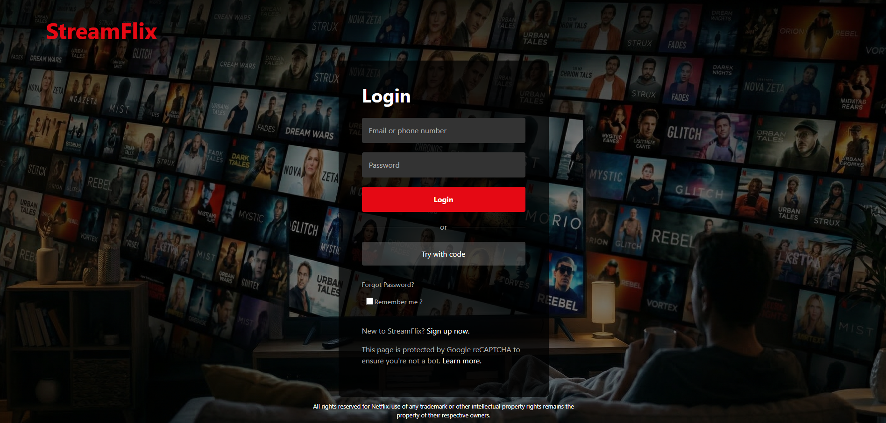
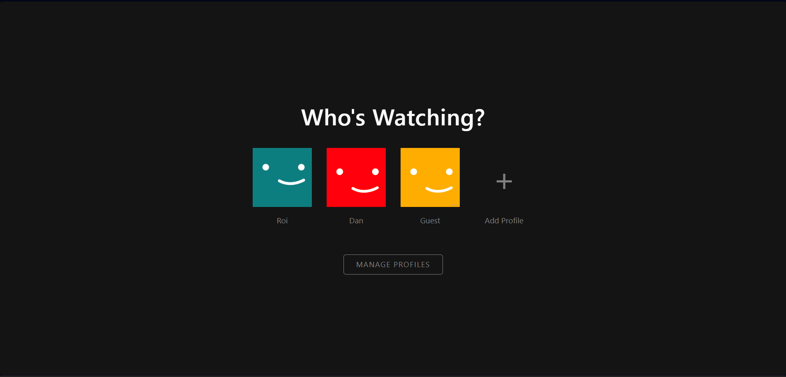
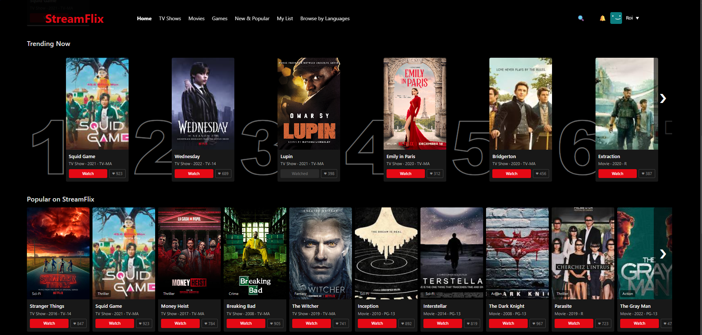
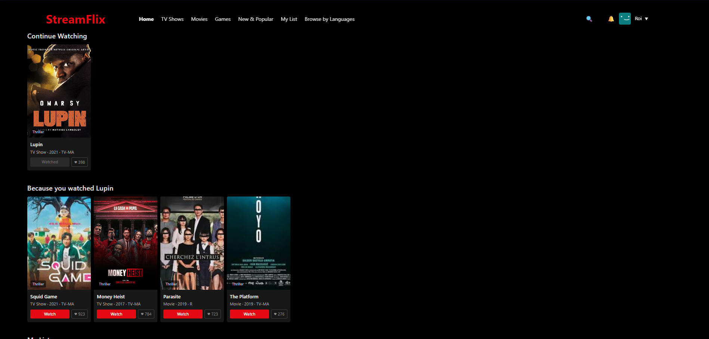

# StreamFlix - Streaming UI Clone

StreamFlix is a frontend web project inspired by modern streaming platforms. It recreates the core user journey of a streaming service, from login and profile selection to a browsable content dashboard with movie and TV show cards.

This project was built as part of a college web development assignment, with a focus on polished UI, responsive layout, and a clean Netflix-style viewing experience using a custom brand identity.

## Screenshots

| Login Screen | Profile Selection |
| --- | --- |
|  |  |

| Home Dashboard | Personalized Recommendations |
| --- | --- |
|  |  |

## Project Overview

The goal of this project was to practice modern frontend development by recreating a realistic streaming-service interface. The design emphasizes dark visual styling, bold red branding, content-heavy layouts, and familiar streaming-product interaction patterns.

## Key Features

- **Authentication Screen:** Login page with styled inputs, a primary call-to-action, secondary code login option, and a cinematic background.
- **Profile Selection:** "Who's Watching?" screen with multiple profiles, avatar tiles, and a manage profiles action.
- **Main Dashboard:** Navigation bar, profile menu, content rows, ranked trending section, poster cards, watch buttons, and like counters.
- **Personalized Page:** Continue-watching and recommendation sections based on selected content.
- **Responsive Layout:** Built with CSS layout techniques to keep the interface aligned across different screen sizes.

## Technologies Used

- **HTML5** for semantic page structure.
- **CSS3** for layout, gradients, hover states, transitions, and responsive styling.
- **JavaScript** for interactive navigation and dynamic content behavior.
- **Custom media assets** for posters, backgrounds, icons, and screenshots.

## Project Structure

```text
Netflix/
+-- css/
+-- html/
+-- images/
|   +-- screenshots/
+-- js/
+-- index.html
+-- interface.html
+-- UserScreen.html
+-- README.md
```

## Disclaimer

This project is for educational and portfolio purposes only. All trademarks, logos, and brand identities related to Netflix remain the property of their respective owners.
