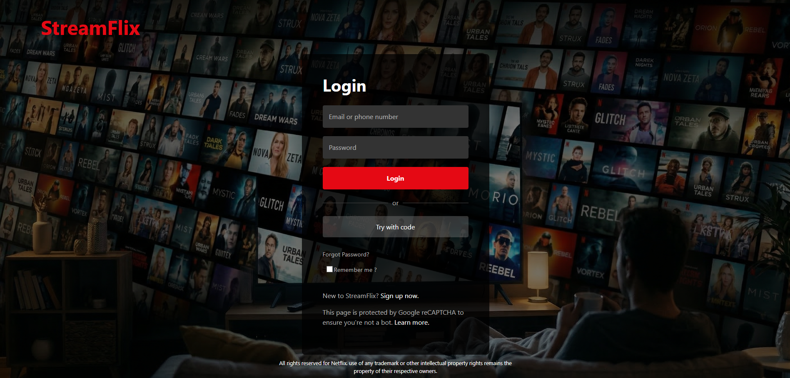
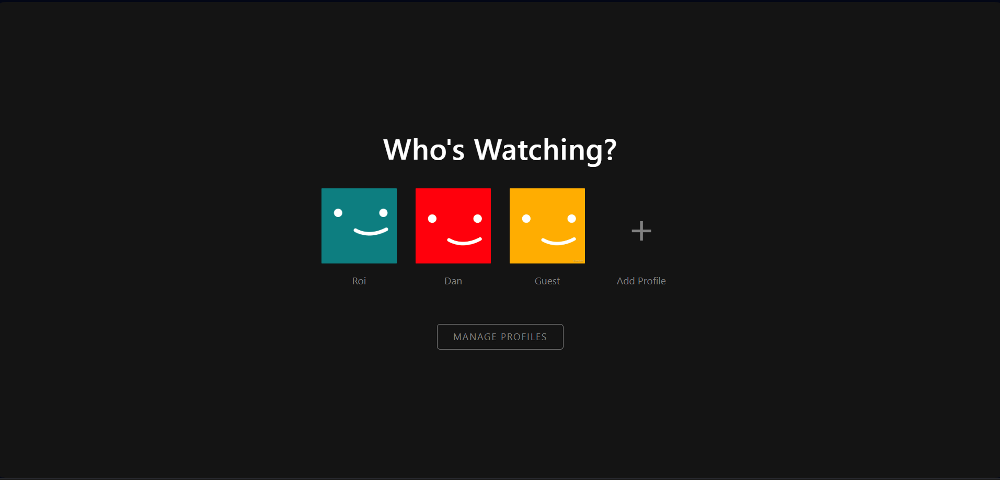
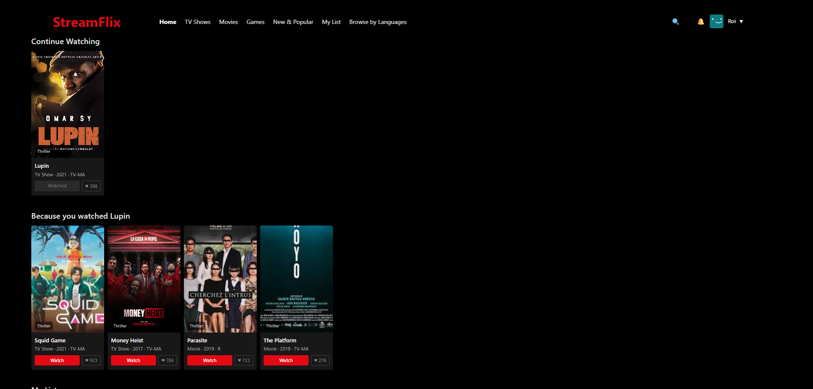
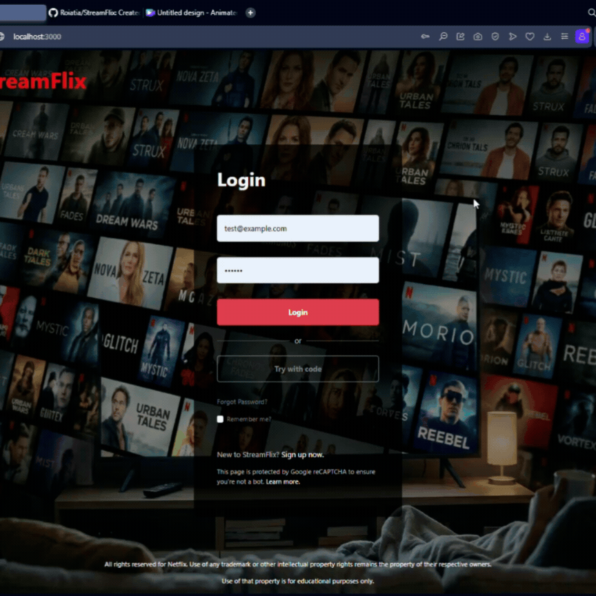
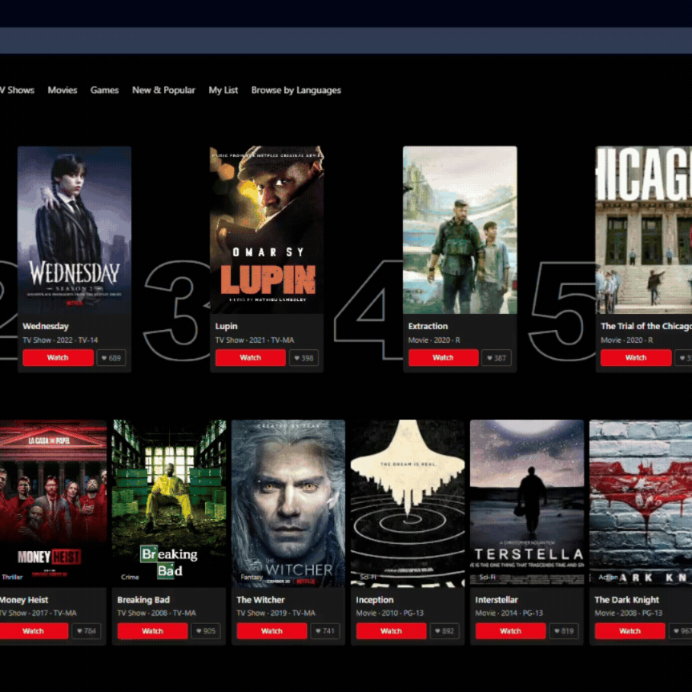
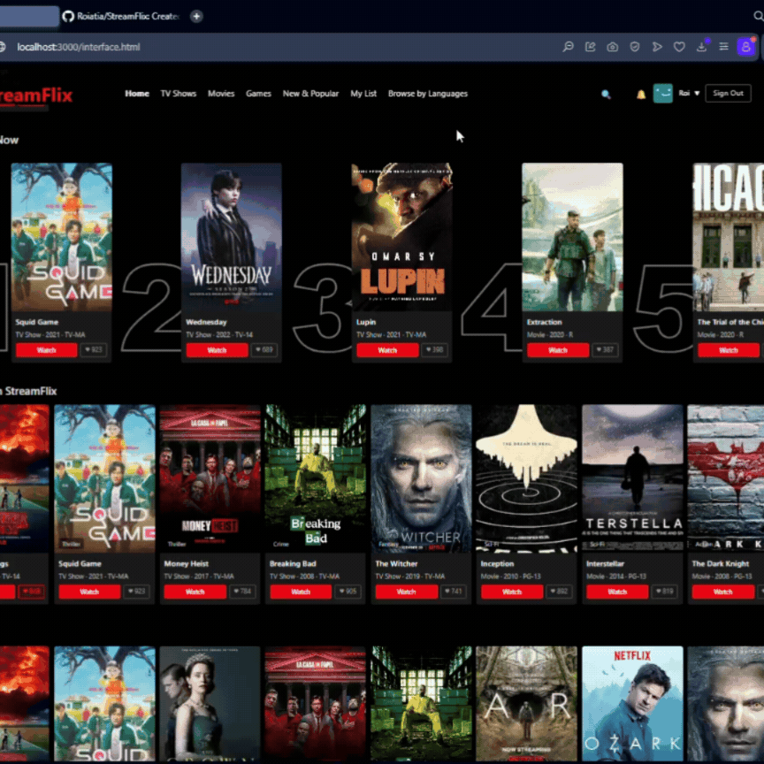

# StreamFlix

StreamFlix is a Netflix-style full-stack web application built for a college Web Development course. Users can register, log in, browse content by profile, search movies and shows, leave reviews, track watch history, and manage community posts. Admins can manage all content through a dedicated admin panel.

---

## Demo

### Screenshots






### GIFs

<table>
  <tr>
    <td align="center"><b>Login</b><br></td>
    <td align="center"><b>Navigation</b><br></td>
    <td align="center"><b>Search</b><br></td>
    <td align="center"><b>Create Post</b><br></td>
  </tr>
  <tr>
    <td align="center"><b>Edit Post</b><br></td>
    <td align="center"><b>Delete Post</b><br></td>
    <td align="center"><b>Filter Posts</b><br></td>
    <td></td>
  </tr>
</table>

---

## Technologies

| Technology | Purpose |
|---|---|
| Node.js | Server runtime |
| Express | Web server and routing |
| MongoDB | Database |
| Mongoose | Models and queries |
| bcryptjs | Password hashing |
| dotenv | Environment variables |
| Bootstrap 5 | UI components on select pages |
| D3.js | Statistics charts |
| Bing Maps API | Interactive map with MongoDB locations |
| HTML5 / CSS3 / JavaScript | Frontend pages |

---

## Setup

1. Install dependencies:

```bash
npm install
```

2. Create a `.env` file in the project root and add your MongoDB connection string:

```env
MONGO_URI=your_mongodb_connection_string
OMDB_API_KEY=your_omdb_api_key
```

> `OMDB_API_KEY` is optional — it is only needed for the "Fetch Movie Info" lookup on the admin content panel. Get a free key at <https://www.omdbapi.com/apikey.aspx>.

3. Seed the database (creates users, profiles, content, and locations):

```bash
npm run seed
```

> On Windows with PowerShell, use `npm.cmd run seed` if the script is blocked by the execution policy.

4. Start the server:

```bash
npm start
```

5. Open the app at `http://localhost:3000`

---

## Seed Accounts

| Role | Email | Password |
|---|---|---|
| Regular user | test@example.com | 123456 |
| Admin | admin@example.com | admin123 |

The seed script reads `data/content.json` and `data/personas.json` to populate content and profiles. It uses `upsert` so it is safe to run more than once.

---

## Project Structure

```text
StreamFlix/
├── config/
│   └── db.js
├── controllers/
│   ├── authController.js
│   ├── contentController.js
│   ├── locationController.js
│   ├── postController.js
│   ├── profileController.js
│   ├── reviewController.js
│   ├── statsController.js
│   └── watchHistoryController.js
├── data/
│   ├── content.json
│   └── personas.json
├── models/
│   ├── contentModel.js
│   ├── locationModel.js
│   ├── postModel.js
│   ├── profileModel.js
│   ├── reviewModel.js
│   ├── userModel.js
│   └── watchHistoryModel.js
├── public/
│   ├── css/
│   │   ├── LoginPage.css
│   │   ├── interface.css
│   │   └── users.css
│   ├── js/
│   │   ├── admin-content.js
│   │   ├── advanced-search.js
│   │   ├── content.js
│   │   ├── content-detail.js
│   │   ├── login.js
│   │   ├── map.js
│   │   ├── nav.js
│   │   ├── persona-navigation.js
│   │   ├── persona-state.js
│   │   ├── posts.js
│   │   ├── profiles.js
│   │   ├── register.js
│   │   ├── search.js
│   │   └── statistics.js
│   ├── images/
│   ├── videos/
│   └── content-images/
├── routes/
│   ├── authRoutes.js
│   ├── contentRoutes.js
│   ├── locationRoutes.js
│   ├── pageRoutes.js
│   ├── postRoutes.js
│   ├── profileRoutes.js
│   ├── reviewRoutes.js
│   ├── statsRoutes.js
│   └── watchHistoryRoutes.js
├── scripts/
│   └── seedDatabase.js
├── utils/
│   └── logger.js
├── views/
│   ├── admin-content.html
│   ├── advanced-search.html
│   ├── content-detail.html
│   ├── index.html
│   ├── interface.html
│   ├── map.html
│   ├── register.html
│   ├── statistics.html
│   └── UserScreen.html
├── .gitignore
├── package.json
├── server.js
└── README.md
```

---

## MVC Structure

- **`models/`** — Seven Mongoose models: User, Content, Profile, Post, Review, WatchHistory, Location.
- **`controllers/`** — Business logic for each resource. Auth uses bcrypt and an in-memory session Map (token → user).
- **`routes/`** — Express routers that map HTTP methods and paths to controller functions. A `requireAuth` middleware protects all private routes; `requireAdmin` gates admin-only actions.
- **`views/`** — Static HTML pages served directly by Express.
- **`public/`** — CSS files, client-side JavaScript, images, and a local demo MP4 video.
- **`utils/logger.js`** — Appends operation and error events to log files at runtime.

---

## Features

- **Auth** — Register, login with bcrypt password hashing, logout. Passwords are never stored in plain text. Sessions are tracked server-side.
- **Role-based access** — Regular users can manage their own data. Admins have full access to all content, profiles, and locations.
- **Profile management** — Create, edit, and delete profiles from the "Who's Watching?" screen. Each profile scopes its own content feed and watch history. Profiles persist across pages via `sessionStorage`.
- **Content browsing** — The home feed shows rows (Trending, Popular, TV Shows, Movies) scoped to the active profile.
- **Search** — Keyword search in the nav bar; an advanced search page with filters for genre, type, year range, rating, and language.
- **Admin content panel** — Admins can create, edit, and delete content through a Bootstrap-powered CRUD UI.
- **Community posts** — Authenticated users can create, edit, and delete posts. Only the post owner or an admin can modify or remove a post.
- **Reviews and ratings** — Users can leave a 1–5 star rating and text review on content. Edit and delete are owner-gated. Reviews can be searched by text and minimum rating.
- **Watch history** — Records which content each profile has watched. Feeds a personalized recommendation row ("Because you watched...").
- **Statistics** — Four D3.js bar charts showing content by genre, content by type, top viewed content, and views by genre. Data comes from MongoDB aggregation pipelines.
- **Map** — An interactive Bing Maps page loads filming/studio locations from MongoDB and places pushpin markers on the map.
- **External movie lookup (OMDb)** — On the admin content panel, a "Fetch Movie Info" button looks a title up on the OMDb API (an IMDB-style external API) and pre-fills the content form (year, genre, rating, plot, poster). Requires `OMDB_API_KEY` in `.env`.
- **HTML5 video** — The Breaking Bad demo detail page includes a local HTML5 `<video>` element for Episode 2 and an embedded YouTube trailer for Episode 1. The episode description uses a CSS3 multi-column layout.
- **Server logging** — All create/update/delete operations are appended to `logs/operations.log`. Unexpected server errors are appended to `logs/errors.log`.

---

## API Overview

| Area | Example routes |
|---|---|
| Auth | `POST /login`, `POST /register`, `GET /logout` |
| Profiles | `GET /api/personas`, `POST /api/personas`, `PUT /api/personas/:id`, `DELETE /api/personas/:id` |
| Content | `GET /api/content`, `POST /api/admin/content`, `PUT /api/admin/content/:id`, `DELETE /api/admin/content/:id` |
| Posts | `GET /api/posts`, `POST /api/posts`, `PUT /api/posts/:id`, `DELETE /api/posts/:id` |
| Reviews | `GET /api/content/:id/reviews`, `POST /api/content/:id/reviews`, `PUT /api/reviews/:id`, `DELETE /api/reviews/:id` |
| Watch history | `GET /api/watch-history`, `POST /api/watch-history`, `DELETE /api/watch-history/:contentId` |
| Statistics | `GET /api/stats/by-genre`, `GET /api/stats/by-type`, `GET /api/stats/views-by-content`, `GET /api/stats/views-by-genre` |
| Locations | `GET /api/locations`, `POST /api/locations`, `PUT /api/locations/:id`, `DELETE /api/locations/:id` |
| External API | `GET /api/external/movie?title=...` (OMDb lookup, admin only) |

All routes return JSON. Private routes require a valid session token sent as a cookie.

---

## Requirements Coverage

| Requirement | How it is covered |
|---|---|
| MongoDB models | 7 Mongoose models with schemas and field validation |
| Full CRUD | Posts, content, profiles, reviews, and locations all have create/read/update/delete |
| Search | Keyword + filter search on content; text search on posts, profiles, and reviews |
| Aggregation | `WatchHistory.aggregate` and `Content.aggregate` power the statistics page |
| D3.js | Four bar charts rendered client-side from aggregated server data |
| External API / Map | Bing Maps SDK with locations from MongoDB, plus an OMDb (IMDB-style) movie lookup on the admin panel via `GET /api/external/movie` |
| HTML5 video | `<video>` element with a local MP4 file on the content detail page |
| CSS3 | Multi-column layout (`column-count`) on episode descriptions |
| Fetch | All client-side pages use `fetch()` for async JSON API calls |
| Validation | Server-side field validation in every controller; client-side checks in all forms |
| Logging | Append-only log files written with `fs.appendFileSync` — no external logging packages |
| Authentication | bcrypt password hashing, session-based auth, ownership checks on all write operations |

---

## Notes

- `.env` is not submitted — it contains the MongoDB URI.
- `node_modules/` is not submitted.
- `logs/` is not submitted — it is in `.gitignore` and created automatically at runtime.
- This project was created for educational purposes only. StreamFlix is not connected to Netflix or any real streaming service.
