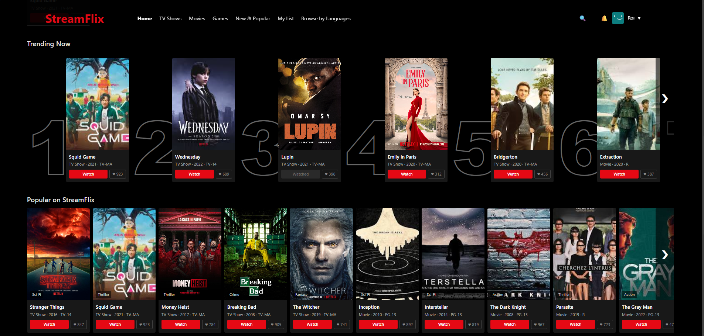

# StreamFlix - Streaming UI Clone

StreamFlix is a frontend web project inspired by modern streaming platforms. It recreates the core user journey of a streaming service, from login and profile selection to a browsable content dashboard with movie and TV show cards.

This project was built as part of a college web development assignment, with a focus on polished UI, responsive layout, and a clean Netflix-style viewing experience using a custom brand identity.

## Screenshots

| Login Screen | Profile Selection |
| --- | --- |
|  |  |

| Home Dashboard | Personalized Recommendations |
| --- | --- |
|  |  |

## Project Overview

The goal of this project was to practice modern frontend development by recreating a realistic streaming-service interface. The design emphasizes dark visual styling, bold red branding, content-heavy layouts, and familiar streaming-product interaction patterns.

## Key Features

- **Login Validation:** Client-side form validation on the login page using vanilla ES6+ JavaScript. Checks that the email field matches a valid format and that the password meets a minimum length requirement. Error messages appear inline below each field and clear as the user types. Submission is blocked with `event.preventDefault()` until all fields pass, then redirects to the profile selection screen.
- **Authentication Screen:** Login page with styled inputs, a primary call-to-action, secondary code login option, and a cinematic background.
- **Profile Selection:** "Who's Watching?" screen with multiple user profiles, avatar tiles, and a manage profiles action.
- **Main Dashboard:** Navigation bar, profile menu, content rows, ranked trending section, poster cards, watch buttons, and like counters.
- **Personalized Feed:** Continue-watching and genre-based recommendation rows driven by per-profile state stored in `localStorage`.
- **Search:** Live search bar that filters the home feed inline or displays a full results overlay on other pages.
- **My List:** Save and remove titles per profile, with a dedicated My List page.
- **Responsive Layout:** Built with Bootstrap 5 and CSS to keep the interface aligned across different screen sizes.

## Technologies Used

- **HTML5** for semantic page structure.
- **CSS3** for custom dark-theme styling, gradients, hover states, and transitions.
- **Bootstrap 5.3** for responsive layout utilities, button styles, form components, and spacing — reducing the amount of hand-written CSS needed for common patterns.
- **JavaScript (ES6+)** for form validation, dynamic content rendering, localStorage state management, search, and navigation.
- **Custom media assets** for posters, backgrounds, icons, and screenshots.

## Project Structure

```text
StreamFlix/
├── css/
│   ├── LoginPage.css
│   ├── users.css
│   └── interface.css
├── images/
│   └── screenshots/
├── content-images/
├── js/
│   ├── login.js
│   ├── content.js
│   ├── nav.js
│   └── search.js
├── index.html
├── UserScreen.html
├── interface.html
└── README.md
```

## Disclaimer

This project is for educational and portfolio purposes only. All trademarks, logos, and brand identities related to Netflix remain the property of their respective owners.
